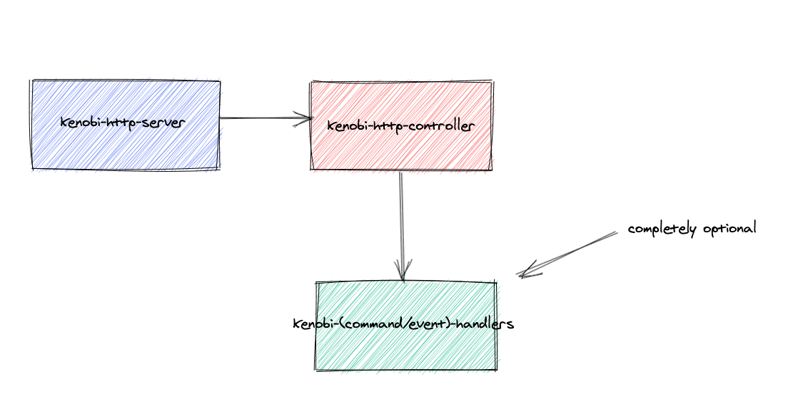

# Welcome to Kenobi 👋


Kenobi is a powerful, robust and clean microservice framework that we designed to rapidly develop services that include your business functionalities.Our main goal is to reduce the repetitive development cost while developing our functionalities, to enable us to focus on the solution of problems and to provide you with many basic capabilities while implementing these solutions.

It takes its name from the obi-wan kenobi, who was the great Jedi master in the Star Wars universe.

The whole structure is built on the [labstack-echo](https://echo.labstack.com/) framework. Our main motivation is to get rid of the cost of solving some problems in the native http implementation within the go. At this point, we do not plan to support "gin" or other microservice frameworks.

## Table of Contents

- [Background](#background)
- [Usage](#usage)
    - [Kenobi Server](#kenobi-server)
    - [Kenobi Http Controller](#kenobi-controller)
    - [Kenobi Command/Event Handler](#kenobi-handler)
    - [Logging](#logging)
    - [Configuration](#configuration)
    - [Caching](#caching)
    - [Marshalling](#marshalling)
    - [Mediator](#mediator)
    - [Http Client](#http-client)
    - [Metrics](#metrics)
- [Example](#example)
- [Maintainers](#maintainers)
- [Contributing](#contributing)
- [License](#license)

## Background


This kenobi contains three basic components, one of which is optional.

You can create and run a http-server with the first of these three basic components. We named this component as kenobi-server.

You can create your APIs and define your interfaces with the second component kenobi-controller.
For now, we only allow a single API structure or interface due to the functional decomposition principle.

Finally, you can develop your own application structure, which includes your business functionalities or domain, with kenobi-handler and use it in a synchronous and / or asynchronous way.
> kenobi-handler is completely optional.

However, it contains many common components like logging, configuration, caching, persistence, http-client etc.  But these components are independent of the three basic components we mentioned above.

The goals for this repository are:

1. Gathering repeated components under the same framework
2. To create new microservices as rapidly as possible
3. Retaining a specific structure when creating a new service

## Usage

### Kenobi Server
You can create a server in a very simple and fast way.

```go
kenobiServer := server.New("NAME_OF_YOUR_APP").UseHttp()
kenobiServer.Start()
```

You can start server with default values. Or, you can define your own settings.

```go
kenobiServer := server.New("NAME_OF_YOUR_APP").UseHttp()
kenobiServer.StartWithOptions(&options.KenobiServerStartOptions{Port: YOUR_PORT})
```

We support gracefully shutdown options. You can use this options.
```go
kenobiServer := server.New("NAME_OF_YOUR_APP").UseHttp()
kenobiServer.StartWithOptions(&options.KenobiServerStartOptions{Port: YOUR_PORT, GracefullyShutdown: true, GracefullyShutdownTimeoutPeriod: YOUR_PERIOD})
```
You can easily use the pre-defined middlewares.

```go
kenobiServer := server.New("NAME_OF_YOUR_APP").UseHttp(). 
                       WithRecoverMiddleware().
                       WithRequestIDMiddleware().
                       WithAllowAnyCORSMiddleware().
                       WithGzipMiddleware().
                       WithHealthCheckMiddleware("/ping", "pong!")
kenobiServer.Start()
```

Or you can apply your custom middlewares.
```go
kenobiServer := server.New("NAME_OF_YOUR_APP").UseHttp().
	                   WithCustomMiddlewares()
kenobiServer.Start()
```

You can use default logger,
```go
kenobiServer := server.New("sample_app").WithDefaultLogger().UseHttp()
kenobiServer.Start()
```
or you can use your own logger.
```go
kenobiServer := server.New("sample_app").WithLogger(YOUR_LOGGER).UseHttp()
kenobiServer.Start()
```
or you can specify your logger options
```go
kenobiServer := server.New("sample_app").WithDefaultLoggerWithOptions(&options.LoggerOptions{--OPTIONS--}).UseHttp()
kenobiServer.Start()
```

On the other hand, You can use the pre-defined http middlewares or you can use your own http middlewares. You can see the available http middlewares in the list below.

* Recover Middleware
```go
kenobiServer := server.New("sample_app").UseHttp().WithRecoverMiddleware()
kenobiServer.Start()
```

* HealthCheck Middleware

```go
kenobiServer := server.New("sample_app").UseHttp().WithHealthCheckMiddleware("YOUR_PATH","YOUR_RESPONSE")
kenobiServer.Start()
```
* Timeout Middleware

```go
kenobiServer := server.New("sample_app").UseHttp().WithTimeoutMiddleware("DURATION_OF_TIME_OUT")
kenobiServer.Start()
```
* CORS Middleware

```go
kenobiServer := server.New("sample_app").UseHttp().WithCORSMiddleware("ALLOWS_VERBS")
kenobiServer.Start()
```
* RequestID Middleware

```go
kenobiServer := server.New("sample_app").UseHttp().WithRequestIDMiddleware()
kenobiServer.Start()
```
* Gzip Middleware

```go
kenobiServer := server.New("sample_app").UseHttp().WithGzipMiddleware()
kenobiServer.Start()
```
* Logging Middleware

```go
kenobiServer := server.New("sample_app").WithDefaultLogger().UseHttp().WithLoggingMiddleware()
kenobiServer.Start()
```
* Prometheus Middleware

```go
kenobiServer := server.New("sample_app").UseHttp().UsePrometheus("YOUR_EXCLUDED_ENDPOINTS")
kenobiServer.Start()
```
* Openstack Middleware

```go
kenobiServer := server.New("sample_app").UseHttp().UseOpenTracing()
kenobiServer.Start()
```
* Newrelic Middleware

```go
kenobiServer := server.New("sample_app").UseHttp().WithNewRelicMiddleware("YOUR_LICENCE_KEY")
kenobiServer.Start()
```


### Kenobi Controller

You must define your own controller using with the controller.HttpController interface.
```go
type HelloWorldController struct {}

func(h HelloWorldController) Name() string {
    return "welcome"
}

func(h HelloWorldController) Prefix() string {
    return ""
}

func(h HelloWorldController) Version() string {
    return ""
}
func(h HelloWorldController) Endpoints() * map[string] map[string] echo.HandlerFunc {
    return &map[string] map[string] echo.HandlerFunc {
        "/say-hi": {
            "GET": func(context echo.Context) error {
                return context.JSON(200, "Hello!")
            },
        },
    }
}

func NewHelloWorldController() controller.HttpController {
    return &HelloWorldController {}
}
```
You can add your own controller to the kenobi-server after defining your controller
```go
kenobiServer := server.New("sample_app").
		WithDefaultLogger().
		UseHttp().
		WithController(NewHelloWorldController())
	kenobiServer.Start()
```
The server will automatically detect your endpoints while it is being created.

### Kenobi Handler

You can use your own command or event handlers.
```go

type HelloWorldCommand struct {
	Name string
}
 
func (*HelloWorldCommand) Key() string { return "HelloWorldCommand" }

type HelloWorldCommandHandler struct{ }


func NewHelloWorldCommandHandler() HelloWorldCommandHandler {
	return HelloWorldCommandHandler{}
}

func (h HelloWorldCommandHandler) Handle(_ context.Context, command mediator.Message)  (interface{}, error) {
	cmd := command.(*HelloWorldCommand)
	return fmt.Sprintf("Hello, %s", cmd.Name), nil
}

```
If you want to use these handlers, you have to make some minor changes to your controller. **Remember, our main motivation is to let developers have their own playground. That's why you have to apply the components you need yourself.**
```go

type HelloWorldController struct {
	mediator *mediator.Mediator
}

func (h HelloWorldController) Name() string {
	return "hello-world"
}

func (h HelloWorldController) Prefix() string {
	return "hello-world"
}

func (h HelloWorldController) Version() string {
	return "v1"
}

func (h HelloWorldController) Endpoints() *map[string]map[string]echo.HandlerFunc {
	return &map[string]map[string]echo.HandlerFunc{
		"/say-hi": {
			"GET": func(echoContext echo.Context) error {
				result, _ := h.mediator.Send(context.Background(), &HelloWorldCommand{Name: echoContext.QueryParam("name")})
				return echoContext.JSON(200, result)
			},
		},
	}
}

func NewHelloWorldController() controller.HttpController { 
	m, _ := mediator.NewContext().
		RegisterHandler(&HelloWorldCommand{}, NewHelloWorldCommandHandler(baseHandler)).
		Build()

	return &HelloWorldController{
		mediator: m,
	}
}

```
Also you can use **Publish()** to your async processes. On the other hand, You can build your own pipelines and add your own pipes to mediator.

### Logging

We preferred to use uber's zap to logging but you can use your own logging provider if you want. You just need to apply logging.Logger interface.

```go
 if defaultLogger, err: = logging.New();
 err != nil {
     panic(err)
 } else {
     defaultLogger.Debug("HELLO,WORLD!")
 }
```

Also, you can customize logger with options.


```go
  if defaultLogger, err: = logging.NewWithOptions( & options.LoggerOptions {
      DefaultParameters: nil,
      Development: false,
      Encoding: "",
      OutputPaths: nil,
      ErrorOutputPaths: nil,
      Level: "",
      TimeKey: "",
      LevelKey: "",
      NameKey: "",
      CallerKey: "",
      StackTraceKey: "",
      MessageKey: "",
      FunctionKey: "",
      EncodeLevel: nil,
      EncodeTime: nil,
      EncodeDuration: nil,
      EncodeCaller: nil,
  });
  err != nil {
      panic(err)
  } else {
      defaultLogger.Debug("HELLO,WORLD!")
  }
```
**We do not planned support sinks for logging.** We strongly recommend that you use the pull-based logging strategy also known as log shippers like fluent-bit, fluent-d or others.

### Configuration
We only support three different configuration  source.
* You can use your local files as a configuration source.
* You can use your remote files as a configuration source.
* You can use your own configuration structure

##### Your local files as a configuration source
You can use your yaml, json, ini and env files as a configuration source.
```go
  if localConfigurationSource, err: = local_file.NewWithOptions("sample_config", "yaml", "./configs/");
 err != nil {
     panic(err)
 } else {
     fmt.Println(fmt.Sprintf("your value is %s", localConfigurationSource.GetStringValueByKey("sample")))
 }
```

Also, you can use consul, etcd and firestore as an configuration source
```go
 watcherDuration, _: = time.ParseDuration("10s")
 if consulConfigurationSource, err: = consul.NewWithOptions("YOUR_CONSUL_ENDPOINT", "yaml", "development", watcherDuration);
 err != nil {
     panic(err)
 } else {
     fmt.Println(fmt.Sprintf("your value is %s", consulConfigurationSource.GetStringValueByKey("sample")))
 }
```
If you want to use remote configuration source, you must specify the duration of watcher.  We will be watching the changes in the configuration source in the time interval you have specified.


### Caching
In fact, the caching is a very complex problem in computer science.We support caching with three different methods.
* Inmemory caching
```go
if inmemoryCachingSource, err  := inmemory.New(); err != nil{
		panic(err)
	}else{
		if err := inmemoryCachingSource.SetValue("sample", "sample"); err != nil{
			panic(err)
		}else{
			if valueFromCache, err := inmemoryCachingSource.GetValueByKey("sample"); err != nil{
				panic(err)
			}else{
				fmt.Println(to.String(valueFromCache))
			}
		}
	}
```
* Distributed Caching
  For now, we support three different redis server of standalone, failover and clustered  as distributed caching source. However, you can use the distributed caching source you want by applying interfaces.DistributedCachingSource.
```go
defaultLogger, _: = logging.New()
defaultMarshaller: = json.New()

redisServer: = standalone.New(defaultLogger, defaultMarshaller, & standalone.StandaloneRedisServerOptions {
    Address: "YOUR_REDIS_SERVER_ADDRESS",
    RedisServerOptions: & options.RedisServerOptions {
        Username: "YOUR_REDIS_SERVER_USER_NAME",
        Password: "YOUR_REDIS_SERVER_PASSWORD",
        Database: 1,
    },
});

distributedCachingSource: = redis.New(redisServer)
expiration, _: = time.ParseDuration("10s")
if err: = distributedCachingSource.SetValue(context.Background(), "sample", "sample", expiration);
err != nil {
    panic(err)
} else {
    var value string
    if err: = distributedCachingSource.GetValueByKey(context.Background(), "sample", value);
    err != nil {
        panic(err)
    } else {
        fmt.Println(value)
    }
}
```
* Hybrid Caching
  You can use both inmemory and distributed caching source at the same time. This method is to implement the "cache-aside" pattern.
```go

func getMyValueFromDatabase() (interface{}, error){
	return "Hello,World", nil
}

```
```go
defaultLogger, _: = logging.New()
defaultMarshaller: = json.New()

redisServer: = standalone.New(defaultLogger, defaultMarshaller, & standalone.StandaloneRedisServerOptions {
    Address: "YOUR_REDIS_SERVER_ADDRESS",
    RedisServerOptions: & options.RedisServerOptions {
        Username: "YOUR_REDIS_SERVER_USER_NAME",
        Password: "YOUR_REDIS_SERVER_PASSWORD",
        Database: 1,
    },
});

distributedCachingSource: = redis.New(redisServer)
inmemoryCachingSource, _: = inmemory.New()

hybridCachingSource: = hybrid.New(inmemoryCachingSource, distributedCachingSource)

expiration, _: = time.ParseDuration("10s")
if val, err: = hybridCachingSource.GetOrSetValueByKey(context.Background(), "sample", expiration, getMyValueFromDatabase);
err != nil {
    panic(err)
} else {
    fmt.Println(val)
}
```
Also, you can develop your own caching providers with using the following interfaces:
InMemoryCachingSource, DistributedCachingSource or HybridCachingSource

### Marshalling
We did not use the native json marshaller due to performance problems. Instead, we used json-iterator by default. You can use our default marshaller or you can use your own choose.
```go
type Marshaller interface {
	Marshall(v interface{}) ([]byte, error)
	Unmarshall(data []byte, v interface{}) error
	MarshallString(v interface{}) (string, error)
	UnmarshallString(data string, v interface{}) error
}

```

### Mediator
We use the mediator pattern because of its many functionality. For this reason, we applied the mediator as a behavior in the kenobi. If you want, you can develop and use your own implementation of mediator pattern using the our Mediator interface. If you need the pipeline behavior, you can use the Pipeline interface or customize it.
```go


type (
	Sender interface {
		Send(context.Context, Message)  (interface{}, error)
	}
	Builder interface {
		RegisterHandler(request Message, handler RequestHandler) Builder
		UseBehaviour(PipelineBehaviour) Builder
		Use(fn func(context.Context, Message, Next)  (interface{}, error)) Builder
		Build() (*Mediator, error)
	}
	RequestHandler interface {
		Handle(context.Context, Message) (interface{}, error)
	}
	PipelineBehaviour interface {
		Process(context.Context, Message, Next)  (interface{}, error)
	}
	Message interface {
		Key() string
	}
)
```


### Http Client
If you want to communicate with a different servers at the http layer, you can use the http-client we developed.
```go
	httClient := http_client.New()
	httClient.UseBaseUrl("BASE_URL").UseTimeout("YOUR_CLIENT_TIMEOUT")
	var responseModel SampleResponseModel
	if rawResponse,  err := httClient.NewRequest().UseResponse(&responseModel).Get("YOUR_SERVER_URL"); err != nil{
		fmt.Println(err)
	}else{
		fmt.Println(rawResponse)
		fmt.Println(responseModel)
	}
```
Also you can customize QoS.

```go
httClient.UseRetryCount(3).UseRetryWaitTime(RETRY_DURATION) 
```

## Metrics
We support statsd, statsite, prometheus, datadog, circois, in-memory and empty sinks, but you can apply and use the sink interface for any third-party product.

```go
 type MetricSink interface {
	SetGauge(key []string, val float32)
	SetGaugeWithLabels(key []string, val float32, labels []Label)
	EmitKey(key []string, val float32)
	IncrCounter(key []string, val float32)
	IncrCounterWithLabels(key []string, val float32, labels []Label)
	AddSample(key []string, val float32)
	AddSampleWithLabels(key []string, val float32, labels []Label)
}
```

## Example


## Maintainers

[@cem-basaranoglu](https://github.com/cem-basaranoglu).

## Contributing

Feel free to dive in! [Open an issue](https://github.com/ereb-or-od/kenobi/issues/new) or submit PRs.
Kenobi follows the [Contributor Covenant](http://contributor-covenant.org/version/1/3/0/) Code of Conduct.

### Contributors

This project exists thanks to all the people who contribute.
<a href="https://github.com/ereb-or-od/kenobi/graphs/contributors"></a>


## License

[MIT](LICENSE) © Cem Basaranoglu
